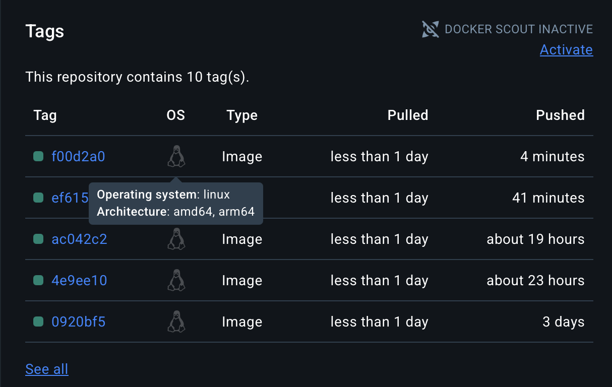

# Projeto DevOps: CI/CD com FastAPI, GitOps e ArgoCD

Este projeto implementa um ciclo completo de CI/CD e GitOps para uma aplicação FastAPI simples.

O objetivo é automatizar todo o processo: desde um `git push` no código da aplicação até a sua implantação automática em um cluster Kubernetes, gerenciado pelo ArgoCD.

## Tecnologias Utilizadas

* **Aplicação:** Python (FastAPI)
* **Contêiner:** Docker
* **Cluster Local:** Rancher Desktop (com Kubernetes)
* **CI/CD (Build e Push):** GitHub Actions
* **Container Registry:** Docker Hub
* **Entrega Contínua (GitOps):** ArgoCD

## Arquitetura e Fluxo de Automação

O fluxo de automação funciona da seguinte maneira:

1.  **Desenvolvedor** faz um `git push` no repositório da aplicação.
2.  **GitHub Actions (CI)** é acionado. Ele builda uma imagem Docker multi-arquitetura (`linux/amd64` e `linux/arm64`).
3.  **GitHub Actions** envia (push) a nova imagem para o **Docker Hub** com uma tag única (o SHA do commit).
4.  **GitHub Actions (CD)** faz o checkout do repositório de **Manifestos**.
5.  **GitHub Actions** atualiza o arquivo `deployment.yaml` com a nova tag da imagem e faz um `push` para o repositório de manifestos.
6.  **ArgoCD**, que está monitorando o repositório de manifestos, detecta a mudança.
7.  **ArgoCD (Sync)** aplica o novo `deployment.yaml` ao cluster **Kubernetes**, que realiza um Rolling Update, atualizando os pods sem downtime.

Configurando o Ambiente (Rancher Desktop + ArgoCD)
Este guia assume que você já possui o Rancher Desktop instalado com o Kubernetes habilitado e configurado como dockerd (moby).

# 1. Instalação do ArgoCD

Primeiro, instalamos o ArgoCD no nosso cluster Kubernetes, em seu próprio namespace.

Criar o namespace para o ArgoCD
`kubectl create namespace argocd`

2. Aplicar o manifesto de instalação oficial
`kubectl apply -n argocd -f https://raw.githubusercontent.com/argoproj/argo-cd/stable/manifests/install.yaml`

2. Acessando a Interface do ArgoCD

Para acessar a interface web do ArgoCD, precisamos da senha inicial e expor o serviço para o localhost.

a) Obter a Senha Inicial: A senha é armazenada em um secret do Kubernetes.

`kubectl -n argocd get secret argocd-initial-admin-secret -o jsonpath="{.data.password}" | base64 -d`

(Copie a senha que aparecer no terminal).

b) Expor o Serviço (Port-Forward): Vamos usar a porta 8081 para o ArgoCD, deixando a 8080 livre para nossa aplicação. Mantenha este comando rodando em um terminal dedicado.

`kubectl port-forward svc/argocd-server -n argocd 8081:443`
Agora, acesse a interface no navegador: https://localhost:8081

Usuário: admin

Senha: (a senha que você copiou acima)

(Note que é https: pois o serviço é exposto via HTTPS (porta: 443 de saida). Pode ser necessário aceitar um certificado autoassinado no navegador).

### Criando o App "hello-app" no ArgoCD

Com o ArgoCD aberto, vamos conectar nosso repositório de manifestos.

Na tela inicial, clique em "NEW APP".

Preencha os campos da seguinte forma:

General

Application Name: `hello-app`

Project: `default`

Sync Policy: `Automatic` (Opcional, mas recomendado para GitOps completo)

Source

Repository URL: `https://github.com/MullerHub/manifest-fastapi-devops.git`

Revision: HEAD

Path: `.` (vai ser a raiz do repositório do github mesmo)

Destination

Cluster URL: `https://kubernetes.default.svc`
(representa o cluster local)

Namespace: `default`

Clique em "CREATE"

Após criar, o ArgoCD irá detectar que o repositório tem manifestos que ainda não estão no cluster. Clique no botão "SYNC" (Sincronizar) para que o ArgoCD aplique os manifestos e crie seu Deployment e Service pela primeira vez.

A partir deste ponto, o ArgoCD monitora o HEAD do seu repositório de manifestos. Qualquer mudança (como as feitas pelo GitHub Actions) será detectada e sincronizada automaticamente (se você marcou a "Sync Policy") ou ficará disponível para sincronização manual.

## Repositórios do Projeto

* **Repositório da Aplicação (Este):** `https://github.com/MullerHub/FastAPI_DevOps`
* **Repositório de Manifestos (GitOps):** `https://github.com/MullerHub/manifest-fastapi-devops`

---

## Evidências de Entrega (As "Entregas Esperadas")

Abaixo estão as evidências que comprovam o funcionamento de cada etapa do projeto.

### 1. Build e Push no Docker Hub

A imagem da aplicação é buildada e enviada ao Docker Hub automaticamente. O print abaixo mostra as tags das imagens no repositório `mullerhub/hello-app`. Note que as imagens são **multi-arquitetura** (indicado pelo `linux/amd64` e `linux/arm64`), o que permite que elas rodem tanto em Macs M1/M2 (ARM) quanto em servidores padrão (AMD64).

Nossa imagem do dockerhub está aqui:
https://hub.docker.com/repository/docker/mullerhub/hello-app/general

---

### 2. Atualização Automática dos Manifestos

Após o push da nova imagem, o GitHub Actions faz um commit automático no repositório de manifestos, atualizando a tag da imagem no `deployment.yaml`.

O print abaixo mostra o **histórico de commits** do repositório de manifestos, com os commits feitos pelo "GitHub Actions Bot".

O "diff" (diferença) de um desses commits mostra claramente a mudança da tag:

---

### 3. ArgoCD com Aplicação Sincronizada

O ArgoCD detecta a mudança no repositório de manifestos e sincroniza o estado do cluster. O print abaixo mostra o "card" da `hello-app` na interface do ArgoCD, com os status `Synced` (Sincronizado) e `Healthy` (Saudável).

---

### 4. Pods da Aplicação Rodando no Kubernetes

A sincronização do ArgoCD resulta em um Rolling Update dos Pods no Kubernetes. O comando `kubectl get pods` mostra os dois pods da nossa aplicação em status `Running`.

Em detalhes, o primeiro terminal acima mostra os pods `kubectl get pods`
o segundo terminal é aonde nosso ArgoCD esta rodando com `kubectl port-forward svc/argocd-server -n argocd 8081:443` ()
detalhe para esse passo aqui, o argoCD esta na porta 8081, para não entrar em conflito com nossa aplicacao que está na 8080, no ultimo terminal está nossa aplicação `kubectl port-forward svc/hello-app-service 8080:80`

